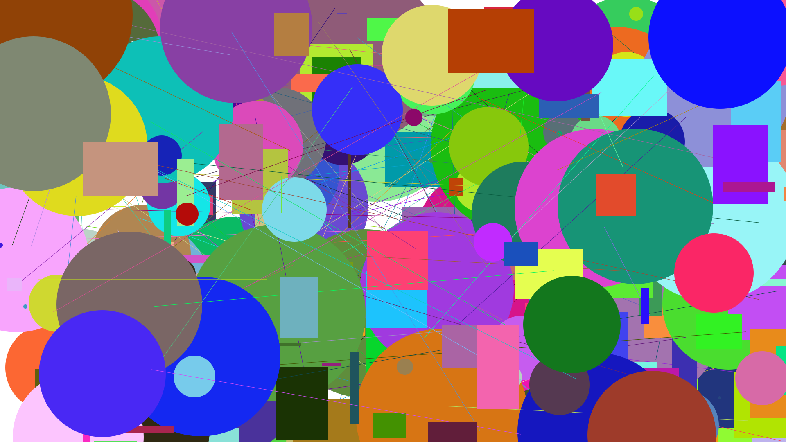
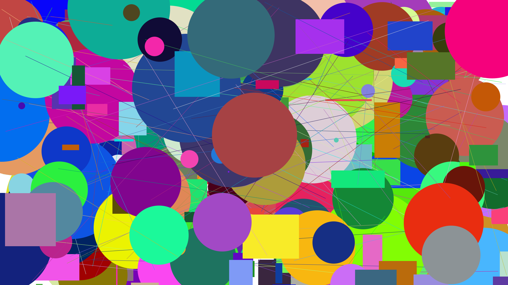
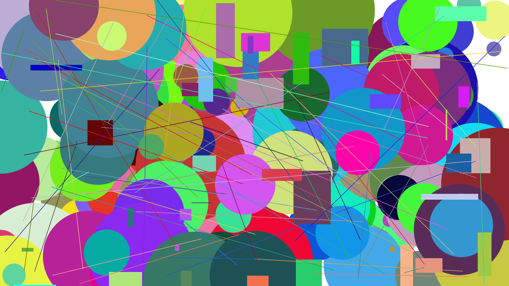
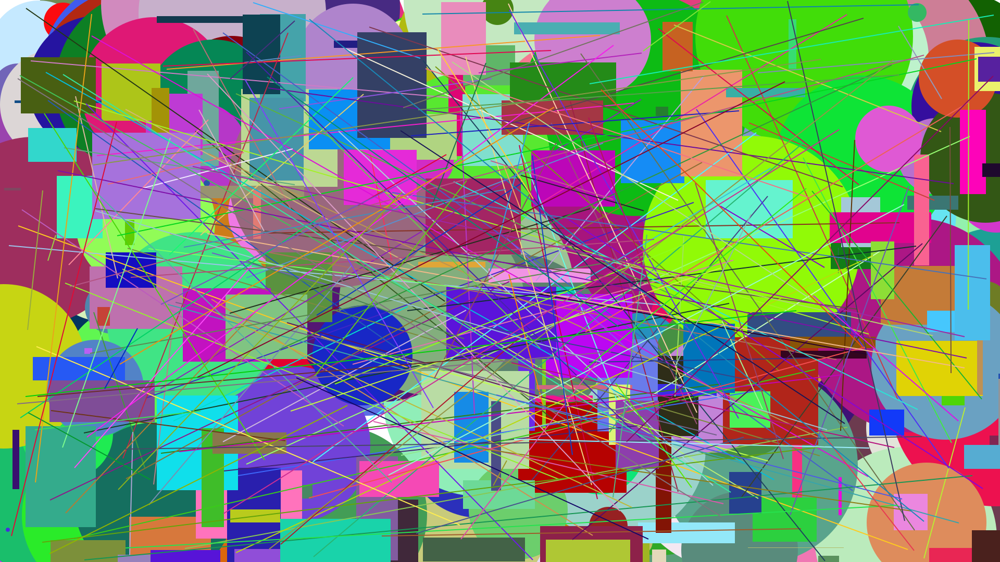

# Geração de Imagens Vetoriais

Aluno: Eduardo Machado de Lima

## Resultados:

A seguir, pode-se analizar os resultados obtidos ao executar os programas em Python e em Haskell.

Resultados em Python:



Como podemos observar, a imagem gerada contém círculos, retângulos e linhas de diferentes tamanhos e cores. Todos os elementos foram gerados aleatoriamente, o que garante que cada vez que o código é executado, uma imagem diferente é gerada.

Resultados em Haskell:



Assim como a primeira imagem, a imagem gerada pelo código em Haskell também contém círculos, retângulos e linhas de diferentes tamanhos e cores gerados aleatoriamente. No entanto, devido às diferenças na estrutura do código e no paradigma de programação utilizado, pode-se observar que há diferenças entre as imagens geradas em Python e em Haskell.

## Execução:

Para executar o código em Python, basta executar o segunite comando no terminal:

```python3 Main.py``` 

Para executar o código em Haskell, basta executar o segunite comando no terminal:

```ghc -e main Main.hs```

Lembrando que é necessário ter o Python e o GHC instalados na máquina e estar na pasta do projeto.

## Análise comparativa:

Os códigos em Python e Haskell apresentados têm a mesma finalidade: gerar imagens SVG aleatórias. No entanto, eles são escritos em linguagens de programação diferentes e seguem paradigmas de programação diferentes, o que resulta em semelhanças e diferenças na estrutura do código e na forma como as tarefas são realizadas.

Uma das principais semelhanças entre os dois códigos é que ambos usam bibliotecas de geração de números aleatórios para gerar elementos aleatórios na imagem SVG. No código em Python, a biblioteca 'random' é usada, enquanto no código em Haskell, a biblioteca 'System.Random' é utilizada. Ambos os códigos também geram elementos aleatórios de forma semelhante, incluindo círculos, retângulos e linhas, com diferentes tamanhos e cores.

Outra semelhança é que ambos os códigos escrevem o arquivo SVG gerado em um arquivo chamado 'output.svg' e ambos possuem constantes para configurar o tamanho da imagem.

No entanto, há também diferenças significativas entre os códigos. A principal diferença é a linguagem de programação utilizada. Python é uma linguagem de programação interpretada, enquanto Haskell é uma linguagem de programação puramente funcional. Isso resulta em diferenças na sintaxe, na forma de escrever código e na forma de se pensar sobre problemas de programação. Por exemplo, o código em Python é mais procedural, enquanto o código em Haskell é mais declarativo.

O código em Python é mais simples e intuitivo, com uma sintaxe mais familiar para muitos programadores, e é mais fácil de entender para aqueles que não estão familiarizados com o paradigma funcional. Além disso, a biblioteca 'random' é mais fácil de usar e tem uma sintaxe mais intuitiva para gerar números aleatórios.

Outra diferença é a forma como são geradas as formas geométricas. O código em Python utiliza uma estrutura de seleção (if, elif, else) para escolher entre três tipos de formas geométricas (círculos, retângulos e linhas) a serem geradas, enquanto o código em Haskell utiliza funções separadas para gerar cada tipo de forma geométrica.

Isso resulta em uma diferença importante entre as imagens geradas, pois altera a ordem em que os objetos são colocados no arquivo SVG. No código em Python, os círculos, retângulos e linhas são postos misturados, ou seja, os elementos são gerados aleatoriamente e adicionados ao arquivo SVG sem seguir uma ordem específica. Isso resulta em uma imagem final com elementos misturados e possivelmente sobrepostos.

Já no código em Haskell, os círculos, retângulos e linhas são adicionados ao arquivo SVG em ordem específica. Todos os círculos são adicionados ao arquivo SVG primeiro, depois todos os retângulos, e por fim, todas as linhas. Isso resulta em uma imagem final com elementos agrupados e não sobrepostos. Nesse caso, nunca haverá um círculo sobreposto a um retângulo ou uma linha, por exemplo. 

Junto a isso, deve-se observar que no código em Haskell nunca haverá mais que um terço do limite máximo de objetos, enquanto o código em Python é possível que 100% dos objetos sejam de um tipo, embora seja pouco provável.Essas diferenças podem ter impacto significativo e isso pode ser visto nos exemplos de imagens geradas pelo código em Haskell acima. 

Também há uma diferença na forma como as cores são geradas. O código em Python utiliza uma string de hexadecimal para representar as cores, enquanto o código em Haskell utiliza a função randomColor para gerar cores no formato RGB. Contudo é uma diferença que não altera o resultado observável nas imagens geradas.

## Créditos:

- [Documentação da Biblioteca 'System.Random'](https://hackage.haskell.org/package/random-1.2.1.1)

- [Tutorial 1 SVG](https://www.w3schools.com/graphics/svg_intro.asp)

- [Tutorial 2 SVG](https://www.freecodecamp.org/news/svg-tutorial-learn-to-code-images/)